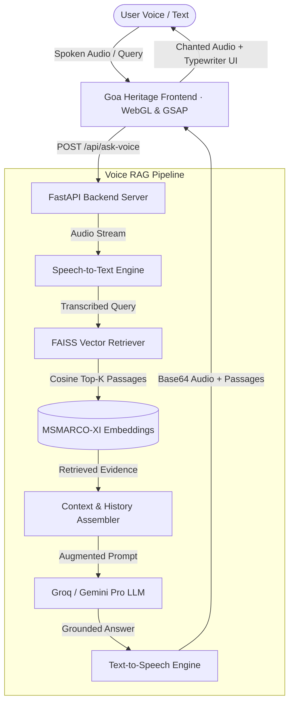

# 📜 MSMARCO-XI · Spoken AI Knowledge Oracle

[](https://fastapi.tiangolo.com)
[](https://python.org)
[](https://github.com/facebookresearch/faiss)
[](https://huggingface.co/datasets/ai4bharat/MSMARCO-XI)
[](https://render.com)
[](https://github.com)

A conversational **Spoken Retrieval-Augmented Generation (Voice RAG)** agent built on the **`ai4bharat/MSMARCO-XI`** dataset. Features a **Goa heritage manuscript UI** (inspired by *Hacker House Goa*), live WebGL acoustic voice analysis, dense neural vector retrieval via **FAISS**, and low-latency synthesis via **Groq / Google Gemini**.

---

## 🌟 Key Features

* 🎙️ **Acoustic Real-Time Vocal Amplitude Analysis**:
  - Live RMS vocal energy tracking via Web Audio API (`ScriptProcessor`).
  - Custom WebGL golden-dithered shader sphere that expands from an idle base dynamically up to $>8\times$ in response to human vocal loudness.
* ⚡ **Dense Vector Neural Retrieval (FAISS)**:
  - Indexed on `ai4bharat/MSMARCO-XI` using `sentence-transformers/all-MiniLM-L6-v2`.
  - Sub-50ms cosine similarity search across passage embeddings with strict Grounded RAG citations.
* 🏛️ **Hacker House Goa Inspired Heritage Scroll**:
  - Parallax manuscript scroll unrolling driven by **GSAP ScrollTrigger** & **Lenis Smooth Scroll**.
  - Edge-to-edge carved wooden spindles with zero-gap unrolling geometry.
  - Antique brass live performance telemetry tickers (STT, Retrieval, Synthesis, TTS, Total Latency).
* 🗣️ **End-to-End Voice Pipeline**:
  - Spoken audio (WAV) $\rightarrow$ Speech-to-Text $\rightarrow$ Vector Search $\rightarrow$ LLM Synthesis $\rightarrow$ Text-to-Speech (gTTS/WebAudio).
* 🧠 **Short-Term Conversational Memory**:
  - Multi-turn sliding context window tracking previous user interactions.
* 🧪 **Robust Verification**:
  - 29 unit & integration tests covering API endpoints, dataset loaders, retrieval pipelines, voice processors, and prompt harnesses.

---

## 🏗️ Architecture



---

## 🚀 Quick Start (Local Setup)

### 1. Clone the Repository
```bash
git clone https://github.com/your-username/msmarco-rag-agent.git
cd msmarco-rag-agent
```

### 2. Create and Activate Virtual Environment
```bash
# Windows
python -m venv venv
.\venv\Scripts\activate

# Linux / macOS
python3 -m venv venv
source venv/bin/activate
```

### 3. Install Dependencies
```bash
pip install -r requirements.txt
```

### 4. Configure API Keys
Copy `.env.example` to `.env` and fill in your keys:
```bash
cp .env.example .env
```
Edit `.env`:
```ini
GROQ_API_KEY=your_groq_api_key_here
# or
GEMINI_API_KEY=your_gemini_api_key_here
```

### 5. Build the Vector Index
```bash
python -m app.build_index
```

### 6. Run the Application
```bash
uvicorn app.main:app --host 127.0.0.1 --port 8000 --reload
```
Open **[http://127.0.0.1:8000](http://127.0.0.1:8000)** in your browser.

---

## 🧪 Running Tests

Execute the full automated test suite with PyTest:
```bash
pytest tests/ -v
```
Output:
```text
======================= 29 passed in 2.45s =======================
```

---

## 🌐 Deploy to Render (1-Click Hosting)

This repository includes a preconfigured [`render.yaml`](./render.yaml) blueprint:

1. Push this repository to your **GitHub** account.
2. Log in to **[dashboard.render.com](https://dashboard.render.com)**.
3. Click **"New +"** $\rightarrow$ **"Web Service"** (or **"Blueprint"**).
4. Select your `msmarco-rag-agent` repository.
5. In the **Environment Variables** section, add:
   - `GROQ_API_KEY`: *(Your Groq API key)*
   - `GEMINI_API_KEY`: *(Your Gemini API key — optional)*
6. Click **"Deploy Web Service"**.

Render will automatically install requirements, index the MSMARCO-XI dataset, and deploy the live web oracle.

---

## 🐳 Docker Deployment

To build and run using Docker:
```bash
# Build Docker image
docker build -t msmarco-rag-agent .

# Run container
docker run -p 8000:8000 -e GROQ_API_KEY="your_api_key" msmarco-rag-agent
```

---

## 📡 API Reference

| Endpoint | Method | Description |
| :--- | :--- | :--- |
| `/` | `GET` | Serves the Goa Heritage Spoken Web Application |
| `/api/ask` | `POST` | Text RAG query (`{ "question": str, "top_k": int }`) |
| `/api/ask-voice` | `POST` | Spoken Voice RAG query (WAV audio file upload via `multipart/form-data`) |
| `/api/memory/clear` | `POST` | Purges multi-turn conversational history |
| `/health` | `GET` | Health status, document count, and active providers |

---

## 📂 Project Structure

```text
msmarco-rag-agent/
├── app/
│   ├── main.py               # FastAPI entry point & routes
│   ├── build_index.py        # Vector index builder for MSMARCO-XI
│   ├── models/               # Pydantic schemas & configuration
│   ├── rag/                  # RAG pipeline, retriever, synthesizer & memory
│   └── voice/                # Audio STT & TTS processors
├── frontend/
│   ├── index.html            # Pinned scroll gate & sanctuary layout
│   ├── styles.css            # Goa botanical design system & unroll styling
│   └── app.js                # WebGL solar orb, Lenis scroll & RMS voice tracker
├── data/                     # Raw datasets & processed index stores
├── tests/                    # 29 unit & integration tests
├── Dockerfile                # Production container specification
├── render.yaml               # Render Blueprint deploy file
├── requirements.txt          # Python dependencies
└── README.md                 # Project documentation
```

---

## 📜 Dataset & Attribution
* **Dataset**: [AI4Bharat MSMARCO-XI](https://huggingface.co/datasets/ai4bharat/MSMARCO-XI)
* **Embedding Model**: `sentence-transformers/all-MiniLM-L6-v2`
* **Theme Inspiration**: Hacker House Goa (`hhgoa.com`) botanical & coastal aesthetic

---

## 📄 License
This project is licensed under the MIT License.
